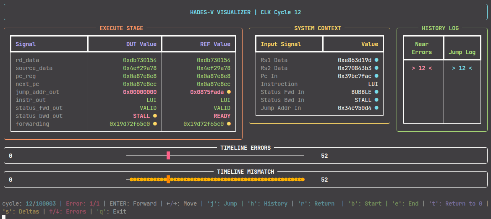

# Hades Trace CLI

Hades Trace CLI is a terminal-based trace visualizer for SystemVerilog debugging in the International RISC-V Challenge `HaDes-V`.

It helps inspect pipeline traces cycle by cycle, compare DUT and REF signals, and locate mismatches without leaving the terminal.



## Why this tool exists

Debugging a SystemVerilog testbench can be slow when failures are buried in long traces and large amounts of signal data.

Hades Trace CLI was built to make that process more visual and interactive:
instead of reading raw logs line by line, you can navigate cycles, inspect signal changes, and jump directly to errors.

## What it does

- Shows DUT and REF values side by side.
- Highlights mismatches clearly.
- Displays input/context signals for each cycle.
- Tracks error cycles and mismatch cycles on a timeline.
- Lets you move through the trace with keyboard shortcuts.
- Exports the current view in plain text for copy-paste debugging.

## Demo workflow

1. Generate a JSON trace from the testbench.
2. Run the CLI on that trace.
3. Navigate through cycles with the keyboard.
4. Jump to errors, inspect deltas, and compare DUT vs REF.
5. Copy the current state when needed for debugging or reporting.

## Controls

- Left / Right arrow: previous / next cycle.
- Up / Down arrow: previous / next error cycle.
- `b`: jump to the first cycle.
- `e`: jump to the last cycle.
- `j`: jump to a specific cycle.
- `h`: open jump history.
- `r`: return to the previous cycle.
- `s`: toggle deltas.
- `p`: print the current view in plain text.
- `q`: quit.

## Output

The interface includes:

- a comparison table for DUT and REF signals,
- a context panel for input signals,
- a history panel for jumps,
- a timeline view for faster navigation.

## Installation

Clone the repository and run the tool with Python 3.

```bash
git clone https://github.com/imserez/hadesv-verification-viewer
cd hades-trace-cli
python main.py
```

If you use a virtual environment:

```bash
python -m venv .venv
source .venv/bin/activate
pip install -r requirements.txt
python main.py
```

## JSON trace format

The tool expects a JSON file generated by the testbench with this structure:

```json
{
  "cycle": 10,
  "error": 0,
  "inputs": {
    "rs1_data": "0x00000000",
    "rs2_data": "0x00000004"
  },
  "dut_values": {
    "pc_reg": "0x00000080",
    "rd_data": "0x12345678"
  },
  "ref_values": {
    "pc_reg": "0x00000080",
    "rd_data": "0x12345678"
  }
}
```

The key names must match between DUT and REF entries so the comparison can work correctly.

## Generate the JSON

The JSON is generated directly from the testbench. This keeps the flow simple and avoids introducing extra processing layers.

### Required signals

The following signals are needed in the generated trace:

- `test_error`: set to `1` when the test fails, typically controlled by the scoreboard, expected as `error` in the JSON file
- `test_count`: tracks the cycle or test index

The following example shows how to generate the JSON in an existing testbench:

```systemverilog
int json_file;          // file descriptor
bit first_entry = 1;    // auxiliary variable to control ',' in JSON

initial begin
    json_file = $fopen("pipeline_trace.json", "w");
    if (json_file) begin
        $fwrite(json_file, "[\n");
    end
    else begin
        $display("ERROR: Error creating pipeline_trace.json");
    end
end

always @(negedge clk) begin
    if (!rst) begin
        if (!first_entry) begin
            $fwrite(json_file, ",\n");
        end
        first_entry = 0;

        $fwrite(json_file, "  {\n");
        $fwrite(json_file, "    \"cycle\": %0d,\n", test_count);
        $fwrite(json_file, "    \"error\": %0d,\n", test_error);

        // --- INPUTS ---
        $fwrite(json_file, "    \"inputs\": {\n");
        $fwrite(json_file, "      \"rs1_data\": \"0x%h\",\n", tb_rs1_data_in);
        $fwrite(json_file, "      \"rs2_data\": \"0x%h\"\n", tb_rs2_data_in);
        $fwrite(json_file, "    },\n");

        // --- DUT VALUES ---
        $fwrite(json_file, "    \"dut_values\": {\n");
        $fwrite(json_file, "      \"rd_data\": \"0x%h\",\n", dut_rd_data_reg_out);
        $fwrite(json_file, "      \"source_data\": \"0x%h\",\n", dut_source_data_reg_out);
        $fwrite(json_file, "      \"pc_reg\": \"0x%h\"\n", dut_program_counter_reg_out);
        $fwrite(json_file, "    },\n");

        // --- REF VALUES ---
        $fwrite(json_file, "    \"ref_values\": {\n");
        $fwrite(json_file, "      \"rd_data\": \"0x%h\",\n", ref_rd_data_reg_out);
        $fwrite(json_file, "      \"source_data\": \"0x%h\",\n", ref_source_data_reg_out);
        $fwrite(json_file, "      \"pc_reg\": \"0x%h\"\n", ref_program_counter_reg_out);
        $fwrite(json_file, "    }\n");

        $fwrite(json_file, "  }");
    end
end

final begin
    if (json_file) begin
        $fwrite(json_file, "\n]\n");
        $fclose(json_file);
    end
end
```

## Current status

This project is still evolving, but the main goal is already in place: make SystemVerilog trace debugging faster, clearer, and less painful.

## Next steps

- Add more flexible filtering for signals.
- Improve trace export automation.
- Support additional views for mismatches and error categories.
- Keep refining the terminal UI for faster debugging.
